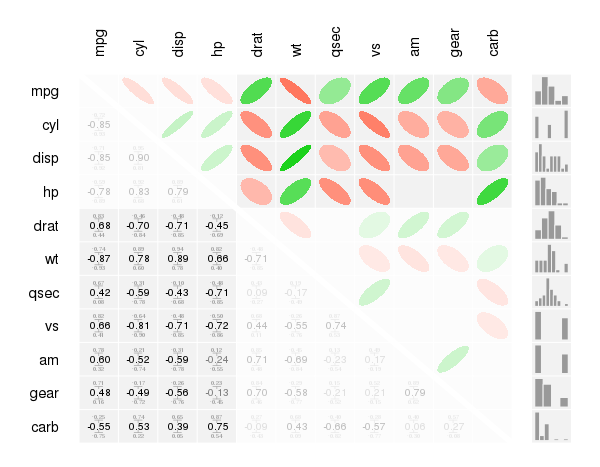
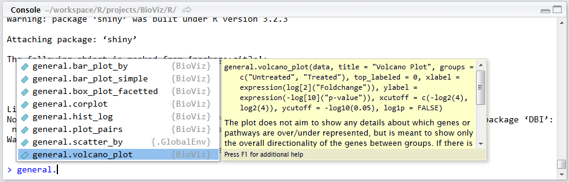

## Overview

BioViz is a provides various plotting functions for the day-to-day work in the RCSS Biomarker group.

## Installation

The easiest way to get BioViz is to install it from source:
1. Click on the download source code button above and download the .tar.gz file.
2. Save the file in your personal RLibrary folder.
3. Install the package from source via

```r
install.packages(“path-to-your-file”, repos = NULL, type=”source”)
```

## Usage
The functions are encapsuled in their respective modules, depending on their category of usage.

general: Includes all general plots like scatterplots, barplots, histograms, but also correlation plots
dimred: Includes all plots regarding dimensionality reduction techniques (e.g. PCA, MCA, t-SNE, ...)
timeseries: All plots regarding timeseries analyses
clustering:  All plots regarding the visualization of clusters (dendrograms, heatmaps, ellipse plots)

After you have loaded the library you can access each of the functions, by accessing the category first and then call
a specific function from this category.

For example:

```r
library(BioViz)
general.corplot(data=mtcars, cor.type=’pearson’, 
                disp.sig.lev=0.05, group.cut=4, 
                conf.level=0.95, cex=0.95, add.hist=TRUE)
```



If you are using an IDE (like RStudio), which provides code completion, this way of accessing is highly convenient.
By typing the function category and a “.” the respective IDE will show each of the functions available within this category.


